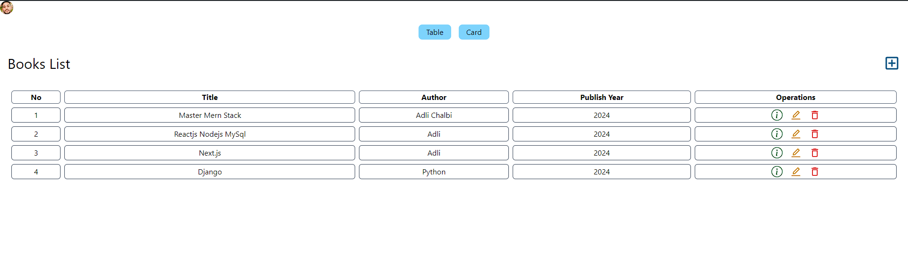
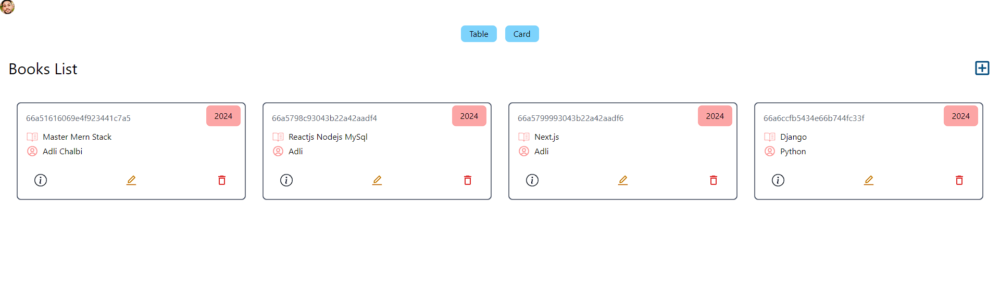
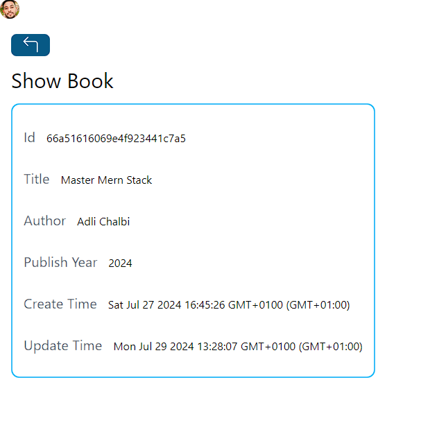

# MERN  Book Store
A fully-featured MERN (MongoDB, Express.js, ReactJS, Node.js) bookstore application, enhanced with Google authentication through Clerk and styled with TailwindCSS. This app empowers users to seamlessly create, edit, delete, and view books in either a table or card layout, with the option to access detailed information about each book.

## Features
* **User Authentication:** Secure authentication using Google, powered by Clerk.
* **Book Management:** Create, edit, delete, and view books.
* **View Options:** Toggle between table and card views to display books.
* **Single Book View:** Detailed information about a single book.
* **Responsive Design:** Styled with TailwindCSS for mobile-friendly layouts.

## Getting Started

#### Prerequisites
* Node.js and npm installed on your machine
* MongoDB instance running locally or in the cloud.
* Clerk account for authentication.

#### Installation
1. **Clone the repository:**
    ```bash
    git clone https://github.com/Adlichalbi/MERN-Book-Store.git
    cd MERN-Book-Store
    ```
2. **Install dependencies for both backend and frontend:**
    ```bash
    # Install backend dependencies
    cd backend
    npm install

    # Install frontend dependencies
    cd ../frontend
    npm install
    ```    
3. **Set up environment variables:**
    * In the `backend` directory, In the `config.js` file change  `mongoDBURL` to your Database URL.
    * In the `frontend` directory, create a `.env` file and add your Clerk API Key
4. **Start the development servers:**
    ```bash
    # Start server
    cd backend
    npm run dev

    # Start client
    cd ../frontend
    npm run dev
    ```
5. **Access the app:**
    * Open your browser and go to `http://localhost:3000`    

## Usage
#### Authentication
* Sign in using your Google account via Clerk. The authentication flow is securely handled by Clerk.

#### Book Management
1. **Create a Book:**
    * Use the "Add Book" form to create a new book entry with fields for title, author and Publish Year.
2. **View Books:**
    * Toggle between table and card views using the provided buttons.
    * Each view will display a list of books, with options to edit , delete or view details of  each entry.
3. **Edit a Book:**
    * Click on the edit icon/button next to a book entry to modify its details.
4. **Delete a Book:**
    * Click on the delete icon/button next to a book entry to remove it from the list.
5. **Single Book View:**
    * Click on the "View" ℹ️ icon to see detailed information about that book.

## Screenshots
#### Table View
<p align="center">  </p>

#### Card View
<p align="center">  </p>

#### Single Book View
<p align="center">  </p> 

## Technologies Used
* **MongoDB:** Database for storing book information.
* **Express.js:** Backend framework for building RESTful APIs.
* **ReactJS:** Frontend framework for building the user interface.
* **Node.js:** Server environment.
* **TailwindCSS:** Utility-first CSS framework for styling.
* **Clerk:** Authentication and user management.

## License
This project is licensed under the MIT License.

## Contributing
Contributions are welcome! Please fork this repository and submit a pull request if you'd like to make improvements or add features.

## Contact
For any questions or feedback, please contact [Adli Chalbi](https://github.com/Adlichalbi).